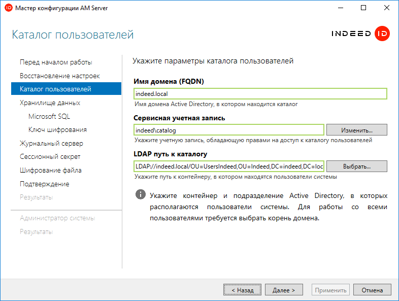

# Indeed AM Core Server

Indeed AM Core Server — это основной модуль системы, который отвечает за:

* централизованное хранение аутентификаторов, паролей и настроек пользователей;
* централизованное управление и администрирование;
* централизованный прием и обработку запросов от других модулей системы;
* координирование действий отдельных модулей и системы в целом.

Core Server кеширует данные при получении пользователя, группы, контейнера, сценариев авторизации и бизнес логики. Основные запросы в каталог — получение пользователя, группы, контейнера по ID — отдаются из кеша. Все остальные запросы — по имени, по телефону, email и т.п. — только обновляют кеш данными из каталога. Первый запрос пользователя по ID также обновляет кеш, последующие берутся из кеша. Время жизни объекта в кеше — 10 минут.
## Привязка HTTPS в настройках в IIS Manager
Indeed Access Manager Server является веб-приложением, которое работает на базе IIS, в процессе установки для него по умолчанию включается обязательное требование SSL в настройках, что в свою очередь требует включенной привязки HTTPS.
<details>
  <summary>Как это сделать</summary>
  <div>
<div>
1. Запустите IIS Manager и раскройте пункт **Сайты** (Sites).
2. Выберите сайт *Default Web Site* и нажмите **Привязки** (Bindings) в разделе **Действия** (Actions).
3. Нажмите **Добавить** (Add):
    * *Тип* (Type) — https.
    * *Порт* (Port) — 443.
    * Выберите *SSL-сертификат* (SSL Certificate).
4. Сохраните привязку.
</div>
</div>
</details>
Если вы не намерены использовать протокол HTTPS, отключите требование SSL в настройках IIS для core и в конфигурационном файле сервера (*C:\inetpub\wwwroot\am\core\Web.config*) измените значение параметра *requireHttps* на *false*.
```jsx title="Пример"
<appSettings>
<add key="requireHttps" value="false" />
</appSettings>
```
## Настройка с помощью мастера конфигурации
Мастер конфигурации по умолчанию запускается автоматически после установки Indeed AM Server, если запуск не был отключен пользователем.

Для запуска мастера вручную откройте файл *C:\Program Files\Indeed AM\Wizard\EA.Server.Wizard.exe.*
:::info[ИНФОРМАЦИЯ]

В мастере включена автоматическая проверка введенных данных, в случае успешного ввода поля будут подсвечены зеленым цветом и вы сможете перейти к следующему шагу, если данные введены некорректно, то поля будут подсвечены красным и вы не сможете перейти к следующему шагу пока не укажете корректные данные.

:::
Дальнейшие шаги зависят от используемой базы данных.

import Tabs from '@theme/Tabs';
import TabItem from '@theme/TabItem';

<Tabs>
  <TabItem value="microsoft SQL" label="Microsoft SQL" default>
    ## Настройка для базы данных Microsoft SQL
    1. На шаге **Перед началом работы** нажмите **Далее**.
    2. На шаге **Восстановление настроек** нажмите **Далее**.
    3. На шаге **Каталог пользователей** укажите следующие параметры:
        * *Имя домена (FQDN)* — укажите полное имя домена, например *domain.local.*
        * *Сервисная учетная запись* — укажите сервисную учетную запись, обладающую правами доступа к пользовательскому каталогу. Нажмите кнопку **Изменить** и укажите требуемые данные учетной записи.
        * *LDAP путь к каталогу* — укажите путь к каталогу с пользователями. Нажмите кнопку **Выбрать** и выберите требуемый контейнер или домен целиком.
        
    6. Шаг **Ключ шифрования**. Выберите алгоритм шифрования, нажмите **Сгенерировать** и нажмите **Далее**.
    :::tip СОВЕТ

Настоятельно рекомендуется выполнить резервную копию ключа шифрования и сохранить в защищенном месте.

:::
  </TabItem>
  <TabItem value="postgre SQL" label="Postgre SQL">
    Приветик
  </TabItem>
</Tabs>


